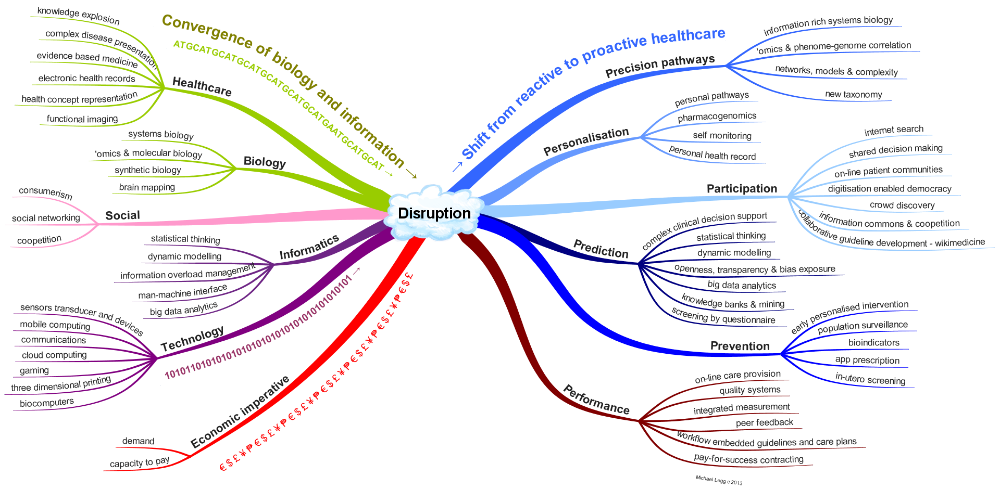

title: 
date: 
categories: doc
---		

  [首页](../home/index.html) >[文档](documentation.html) > **未来的挑战**	

##1.11	附录： 信息学在被动式医疗向主动式医疗转变中的作用 

正值医疗IT技术开始转变医疗卫生领域之时，我们提出了FHIR标准。这部分内容描述了一部分这种转变的原理，进一步说明一下FHIR出现的大背景。  

正如JohnSnow利用地理位置分析(信息学的一个分支)来确定霍乱在伦敦的病源地，进而在1854年证明了胚种学说，带来了医学革命，信息学的应用和相关技术在下一次的医疗卫生领域的变革中也是很有帮助的.   

所有发达国家都面临着老龄化和慢病引起的卫生保健服务需求的增加。很多国家也缺乏有经验的从业人员。越来越多的证据指出可避免的医疗过失给病人造成了严重的伤害。事实上，即使在最好的医疗体系中，最好的卫生保健也只能占到大约一半(1)。即使能够持续改进也不足以解决可持续医疗卫生所面临的迫在眉睫的危机。   

医疗卫生、生物学、信息技术以及相关的社会变革和经济学的结合带来的模式上转变也许正是答案(2)。信息学能够在诸多方面发挥作用。下图总结了这些趋势，以及从被动式向主动式医疗转变的可能的结果。

就我们对physiological pathways的理解,信息学已经成为分子生物学的主要工具.比如,对于基因测序，花在计算上的时间是化学分析的的三倍。信息学用在神经网络的映射，构建精度和复杂度都不断提高的系统生物学模型(3)，这在没有电脑的帮助下是无法完成的。近来我们的认识变化如此之快，美国科学院认为这将成为一个新的学科(4)。 	

由于社会的变化、生物学知识的不断增长带来了个性化的出现，便宜的移动计算、传感器和设备促进了个性化的发展。这样的一些社会性驱动力和实现技术使得更多非专家人士参与到决策、治疗、发现和知识管理的过程中. 		

更深入的了解人类如何思考(5)，信息科学的发展，计算能力的可及性不断提高，这意味着我们获取知识，使用知识来预测病理过程的能力极大地提升了，这是好事，否则是无法应付因为信息爆炸式出现的情况。这些新能力可以用在提供更好的建议，通过疾病发现更好的预防疾病，更好的管理和治疗疾病。 

在线诊疗，实时的将质量测度和知识集成到工作流中，这些看起来有点像信息技术利用的第二阶段，医疗卫生系统自身也能从中受益。尽管保持公开性和透明性，但仍然存在竞争，在良好的测度之下，pay-for-success契约方式可作为一个经济学杠杆。

医疗卫生领域大规模的改革是必要的，也是不可避免的。看起来，知识、机器、生物学和信息革命的融合将促使被动式治疗向主动式个性化治疗转变。只有借由这些转变，我们所需的卫生保健的效率、效益才能得到改善。

数字化技术的发展已经摧毁了其他部门，特别是媒体业、制造业和零售业，医疗行业也逃不过此劫(6)。生物学和卫生保健的数字化将使得机器可以帮助我们揭开疾病的神秘面纱，实现卫生保健的民主化，从疾病治疗向健康的促进和维护转变。

**References**

1.  CareTrack: assessing the appropriateness of health care delivery in Australia. Runciman WB, Hunt TD,    Hannaford NA, Hibbert PD, Westbrook JI, Coiera EW, Day RO, Hindmarsh DM, McGlynn EA, Braithwaite J. 2,    16 July 2012, Med J Aust. 2012 Jul 16;197(2):100-5. PubMed PMID: 227, Vol. 197(2), pp. 100-5
2.  Kuhn, Thomas S. The Structure of Scientific Revolutions. Chicago : University of Chicago Press, 1962
3.  Hood, Leroy. Institute of Systems Biology. [Online] [Cited: 25 May 2013.] [https://www.systemsbiology.org/leroy-hood](https://www.systemsbiology.org/leroy-hood)
4.  Board on Life Sciences, Committee on A Framework for Developing a New Taxonomy of Disease. Toward Precision Medicine; Building a Knowledge Network for Biomedical Research and a New Taxonomy of Disease. Washington, DC : The National Academic Press, 2011
5.  Kahneman, Daniel. Thinking, Fast and Slow. New York : Farrar, Straus and Giroux, 2011
6.  Topol, Eric. The Creative Destruction of Medicine - How the Digital Revolution Will Create Better Health Care. New York : Basic Books, 2012.

* * *

这部分是 [Michael Legg](mailto:michael.legg@mlanda.com.au)在维护。	

&copy; HL7.org 2011+. FHIR DSTU (v0.4.0-3900) 构建于2014  12月20号 2014 22:38+0000 星期六 . 
  链接：[试行版是什么](http://hl7.org/implement/standards/fhir/dstu.htmll) |[版本更新情况](http://hl7.org/implement/standards/fhir/history.htmll) | [许可协议](http://hl7.org/implement/standards/fhir/license.htmll) |[提交变更建议](http://gforge.hl7.org/gf/project/fhir/tracker/?action=TrackerItemAdd&tracker_id=677)