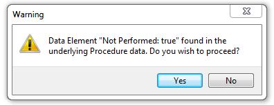

title: 
date: 
categories: doc
---

[首页](../home/index.html) >[文档](documentation.html) >[资源定义](resources.html) >**扩展**       

这部分:

[Extensibility](#root)

[isModifier](#isModifier)

[Defining Extensions](#definition)   

#### 1.12.6.0  扩展        

同时请参考扩展[示例](extensibility-examples.html).                     

该交换标准是以卫生保健领域普遍认可的通用需求为基础-涵盖多个地区,领域和不同的函数式方法.因此,对于某个特殊的实现而言,会存在一些标准中并没有覆盖的需求,如果将所有这些需求都融合到标准中将会导致标准非常冗长且难于实现.然而,该标准期望在实现中将此类区域性的额外需求视为扩展.            

因此,扩展是该标准设计中的基础部分,资源的每个元素都可能会有extension子元素,用以标识不属于资源基础定义的其他信息.应用程序不应只是因为资源中包含扩展而拒绝它们,尽管可能会由于扩展中的某些特殊内容而拒绝它们.              

需要注意的是,与其他标准不同的是,无论是机构还是地区定义或使用了这些扩展,在任何应用程序,项目或标准中,都不应该对扩展的使用感到困扰.正是由于对扩展的使用才使得对于每个人而言,FHIR标准能够保持它的简单性.                      

为了安全,易管理的使用扩展,对于扩展的定义和使用有严格的治理机制.尽管允许开发人员定义和使用扩展,在定义和使用扩展时也必须满足一系列的要求.           

#####  1.12.6.0.1 扩展的元素

资源或数据类型中的每个元素都有一个可选的可出现任意次数的 &quot;extension&quot; 子元素, &quot;extension&quot; 子元素在所有子元素中第一个出现,优先于其他所有子元素,每个资源中所出现的&quot;extension&quot; 的内容模型如下:                                            

<pre class="spec">&lt;<a title="Optional Extensions Element - found in all resources." class="dict" href="base-definitions.html#Extension"><b>[name]</b></a> xmlns=&quot;http://hl7.org/fhir&quot; url=&quot;identifies the meaning of the extension (<a href="datatypes.html#uri">uri</a>)&quot;&gt; 
 &lt;!-- from Element: <a href="extensibility.html">extension</a> --&gt;
 &lt;<a title="Value of extension - may be a resource or one of a constrained set of the data types (see Extensibility in the spec for list)." class="dict" href="base-definitions.html#Extension.value_x_"><b>value[x]</b></a>&gt;&lt;!-- <b>0..1</b> <a href="datatypes.html#open">*</a> Value of extension --&gt;&lt;/value[x]&gt;
&lt;/[name]&gt;
</pre>                         

                        

其他定义: 资源规范 ([XML](Extension.profile.xml.html), [JSON](Extension.profile.json.html))                          

注意事项:               

*    url是一个强制性属性,是对定义了扩展内容和含义的[资源规范](profile.html)的标识                   
*   扩展的实际内容要么是value[x]元素,要么是包含其他扩展,每个扩展都有对应的定义它们的URL和各自的内容.                 
*   一个扩展应包含一个value元素或者子扩展.  value[x]元素应包含content和或id属性,id属性是Narrative叙述性文本中引用的目标.              
*   当某个扩展成为内部引用的目标,When an extension is the target of an internal reference, the reference is always to the value of the extension. An extension is only allowed to be the target of a reference when it has no value[x]
*   对于大多数扩展而言,处理资源内容的应用程序无视该扩展的内容应该是安全的.尤其是,对于扩展内容的理解不会改变包含它的元素的含义.更多讨论参考如下内容.                

value[x]元素中的[x]可以用如下的任意一种数据类型替换:

*   [integer](datatypes.html#integer)
*   [decimal](datatypes.html#decimal)
*   [dateTime](datatypes.html#dateTime)
*   [date](datatypes.html#date)
*   [instant](datatypes.html#instant)
*   [string](datatypes.html#string)
*   [uri](datatypes.html#uri)
*   [boolean](datatypes.html#boolean)
*   [code](datatypes.html#code) (only if the extension definition provides a [fixed](terminologies.html#code) binding to a suitable set of codes)
*   [base64Binary](datatypes.html#base64Binary)
*   [Coding](datatypes.html#Coding)
*   [CodeableConcept](datatypes.html#CodeableConcept)
*   [Attachment](datatypes.html#Attachment)
*   [Identifier](datatypes.html#Identifier)
*   [Quantity](datatypes.html#Quantity)
*   [Range](datatypes.html#Range)
*   [Period](datatypes.html#Period)
*   [Ratio](datatypes.html#Ratio)
*   [HumanName](datatypes.html#HumanName)
*   [Address](datatypes.html#Address)
*   [Contact](datatypes.html#Contact)
*   [Schedule](datatypes.html#Schedule)
*   [Resource](references.html#ResourceReference) - a reference to another resource

如果原始的扩展定义了复杂的内容,该扩展会包含其他子扩展,而不是用value来表达.   如果扩展的value本身需要扩展,这些扩展位于value[x]元素的内容当中.               

如下,name包含部落名称的扩展:              
<pre class="xml" fragment="HumanName">
&lt;name&gt;
  &lt;extension url=&quot;http://hl7.org/fhir/Profileiso-21090#name-use&quot; &gt;
    &lt;valueCode value=&quot;I&quot; /&gt;
  &lt;/extension&gt;
  &lt;text value=&quot;Chief Red Cloud&quot;/&gt;
&lt;/name&gt;
</pre>

 JSON格式:

<pre class="json">
&quot;name&quot; : {
  &quot;extension: [
    {
      &quot;url&quot; : &quot;http://hl7.org/fhir/Profileiso-21090#name-use&quot;,
      &quot;valueCode&quot; : &quot;I&quot;
     }]
  &quot;text&quot;: &quot;Chief Red Cloud&quot;/&gt;
}
</pre>

下面讨论如何正确的使用URL值 .          
对patient进行扩展,是否参加clinical trial的状态属性,其中又包含三个字段 : 状态,记录日期.记录人员status, date of recording, and person who recorded:                
<pre class="xml" fragment="Patient">
&lt;Patient&gt;
  &lt;extension url=&quot;http://acme.org/fhir/Profile/main#trial-status&quot; &gt;
    &lt;extension url=&quot;http://acme.org/fhir/Profile/main#trial-status-code&quot; &gt;    
      &lt;valueCode value=&quot;unsure&quot; /&gt;    
    &lt;/extension&gt;
    &lt;extension url=&quot;http://acme.org/fhir/Profile/main#trial-status-date&quot; &gt;    
      &lt;valueDate value=&quot;2009-03-14&quot; /&gt;    
    &lt;/extension&gt;
    &lt;extension url=&quot;http://acme.org/fhir/Profile/main#trial-status-who&quot; &gt;   
      &lt;valueResource&gt;   
        &lt;reference value=&quot;Practitioner/example&quot; /&gt;          
      &lt;/valueResource&gt;    
    &lt;/extension&gt;
  &lt;/extension&gt;
  &lt;!-- other data for patient --&gt;
&lt;/Patient&gt;
</pre>

JSON格式:

<pre class="json">
{
  &quot;resource-type&quot; : &quot;Patient&quot;,
  &quot;extension&quot; : [
    {
      &quot;url&quot; : &quot;http://acme.org/fhir/Profile/main#trial-status&quot;,
      &quot;extension&quot; : [
        {
          &quot;url&quot; : &quot;http://acme.org/fhir/Profile/main#trial-status-code&quot;,
          &quot;valueCode&quot; : &quot;unsure&quot;
        }, 
        {
          &quot;url&quot; : &quot;http://acme.org/fhir/Profile/main#trial-status-date&quot;,
          &quot;valueDate&quot; : &quot;2009-03-14&quot;
        }, 
        {
          &quot;url&quot; : &quot;http://acme.org/fhir/Profile/main#trial-status-who&quot;,
          &quot;valueResource&quot; : {
            &quot;reference&quot; : &quot;Practitioner/example&quot;
          }
        }
     ]
   }
  ], 
  ... other data for patient... 
}
</pre>

#####  1.12.6.0.2 扩展修饰符Modifier Extensions

有一些情况,扩展中的信息会修饰包含它的元素的含义.典型的,这也就是说信息能够否定或证明包含它的元素含义.例如:            
*   给 [Adverse Reaction](adversereaction.html)加一个确定性扩展,值为 &quot;highly doubtful&quot;            
*   给 [value set](valueset.html)中的某个概念新增一个包含关系                  
*   某个反对药物的人:记录一条不用药的指令                 
*   利用 [Condition](condition.html)资源记录断言:病人并没有某个诊断         
*   声明 医务人员并没有参与某个[Procedure](procedure.html)
*   记录并没有提供某个[Supply](supply.html)(i.e. 拒绝配药refusal to fill)

开发人员宜尽可能避免使用扩展修饰符/限定符.任何使用应谨慎考虑可能引发的后果.然而,由于资源使用的业务要求,开发人员常常不得不这么做,因此,该标准中提供了一个处理此类问题的框架.                    
 
如果出现了扩展限定符,除非应用程序知道扩展对于数据使用的用途,否则应用程序无法安全的处理它. 该标准中允许在资源的基础部分或没有数据类型的任意元素中包含修饰符元素(比如资源UML图中类对应的元素),元素名称为&quot;modifierExtension&quot;,内容与extension元素相同.                             

处理资源中数据的实现应该能够理解使用扩展时扩展所带来的影响.如果处理资源内容的应用程序无法识别modifierExtension,且应用程序要处理它所扩展元素的内容,应用程序应该要么拒绝处理数据,要么对数据相关的操作或者是从数据处理中所得到的结果输出发出警示,以告知使用者它并没有充分理解原始信息.             

并不要求开发中以任何有意义的方式&quot;support&quot;扩展-它们可以拒绝这些包含扩展的实例,也能够理解.另外,开发中可能会根据开发环境,确定不会使用这些扩展.然而,不管怎样,应用程序都宜对扩展进行检查核对.     

需要注意的是资源中数据的处理一般而言意味着将资源中的数据复制或过滤出来用以其他的场合(展示给人看,决策支持,以另一种格式对部分信息进行交换,为了其他用途而存储).的如果服务器和后台处理过程只是将整个资源进行转移,资源本身未发生变化也就不是"对资源数据的处理",因此这类程序不需要核对哪些未知的扩展.             

######  1.12.6.0.2.1 总结:扩展修饰符的一致性规则            

*    modifierExtension应只修饰它所包含和或它的子元素              
*    对于将叙述性文本展示给人看,modifierExtension总是应该保持安全性,任何扩展修饰符都应该展现在叙述性文本当中                         
*   当要处理包含扩展修饰符的元素中的数据时,应用程序总是应核对 modifierExtension,如果发现了不能理解的 modifierExtension,应用程序应要么拒绝处理该资源或受影响的元素,要么给用户提供警告.                   

######  1.12.6.0.2.2  范例

范例:由于临床上缺乏共识,[Procedure](procedure.html) 中并没有任何表示 Allergy/Intolerance的元素,一些系统中将entry标记为&quot;unlikely&quot; or &quot;probable&quot;.允许应用程序对资源进行如下扩展.            

<pre class="xml">
&lt;AllergyIntolerance&gt;
  &lt;modifierExtension&gt;
    &lt;url value=&quot;http://example.org/fhir/extensions#certainty&quot; /&gt;
    &lt;valueCoding&gt;
      &lt;system value=&quot;http://example.org/codes/certainty&quot;/&gt;
      &lt;code value=&quot;2&quot;/&gt;
      &lt;display value=&quot;Unlikely&quot;/&gt;
    &lt;/valueCoding&gt;
  &lt;/modifierExtension&gt;
  &lt;!-- .. text etc... --&gt;
&lt;/AllergyIntolerance&gt;
</pre>                      

当应用程序能够理解该扩展,也就是说开发人员能够正确处理它所包含的数据.注意,应用程序如何处理都没有责任-尽管不总是这样子,如果在这样的场景下是安全的,应用程序可以无视扩展,          

当不能理解扩展的应用程序试图处理该资源时,要求应用程序要么拒绝处理该资源,要么给用户发出警告.这两种操作的过程都可能极为复杂.其中一种选择是(从提供的URL中)下载定义该扩展的规范,找到扩展名称,然后在展示扩展内容时使用扩展名称,错误信息应该如下:              
                     

注意资源的叙述性文本应包含此类限定性信息,因此将它们作为资源内容的一种表达展现给用户是安全的.警告对话框可以进一步让用户选择是否查看原始的叙述性文本.                    

如下的例子是对某个特殊的手术中并未进行某项操作的声明:                   

<pre class="xml">
&lt;Procedure xmlns=&quot;http://hl7.org/fhir&quot;&gt;
  &lt;text&gt;
    &lt;status value=&quot;generated&quot;/&gt;
    &lt;div xmlns=&quot;http://www.w3.org/1999/xhtml&quot;&gt;Routine appendicectomy for Fred Smith performed By Susan Taylor. Note: This operation was not performed by Dr Lakin&lt;/div&gt;
  &lt;/text&gt;
  &lt;!-- ...data... --&gt;
  &lt;performer&gt;
    &lt;modifierExtension&gt;
      &lt;url value=&quot;http://example.org/fhir/extensions#didNotPerform&quot;/&gt;
      &lt;valueBoolean value=&quot;true&quot;/&gt;
    &lt;/modifierExtension&gt;
    &lt;person&gt;
      &lt;reference value=&quot;Practitioner/example&quot;/&gt;
      &lt;display value=&quot;Dr Lakin&quot;/&gt;
    &lt;/person&gt;
  &lt;/performer&gt;
  &lt;!-- ...data... --&gt;
&lt;/Procedure&gt;
</pre>                    

在这种情况下,如果应用程序并没有读取操作人员/performer的信息,某个操作人员有一个modifierExtension的事实就显得无关紧要,应用程序完全可以忽略它.          

######  1.12.6.0.2.3  特殊情况:数据丢失         

在某些情况下,开发人员可能找不到某个最小基数为1的元素数据,这时候,整个元素必须出现,但是除非资源本身或者规范中说明了该元素的基础数据类型的值是强制出现的,我们可以提供一个扩展来解释为什么该基础数据类型值并不存在.        
<pre class="xml">
&lt;uri&gt;
  &lt;extension url=&quot;http://hl7.org/fhir/Profile/general-extensions#data-absent-reason&quot;&gt;
    &lt;valueCode=&quot;unknown&quot;/&gt;
  &lt;/extension&gt;
&lt;/uri&gt;
</pre>

这个例子中,较之value,我们提供了一个[data missing code](general-extensions.html).注意并不要求使用此类扩展,这个扩展并不是扩展修饰符,因为基础数据类型并没有value.       

给基础数据类型值创建虚拟数据是无效的,然后添加一个扩展来说明这些数据是用来满足数据 规则的.这种想法是很糟糕的,同时这些数据类型中是不允许扩展修饰符存在的.         

#####  1.12.6.0.3 扩展的交换     

扩展是一种能够在资源中使用同一个信息模型体现本地需求的方法,因此所有系统都能够用同样的工具安全的处理它们.然而,当要处理此类信息时,应用程序能够处理的程度受限于别人告知它们的程度.            
 

当扩展的结构化定义总是能够获取时,仅仅是能够自动的获取定义并不意味着应用程序知道如何正确的处理它们-一般而言,如何处理扩展数据需要人来决定,           

鉴于此,作为扩展出现的本地化需求是集成的障碍.共有的需求越多(区域层面或国家层面上),它们产生的影响就越小.该标准中所定义的对扩展统一的表达,定义和注册并不能解决这个问题-只是提供了一种此类变化能够更加任意处理的框架而已.            

当部署了支持本地化需求的应用程序时,支持不同扩展的应用程序间交换信息时就会出现一些问题.该标准中包含了一些基本规则使得针对这些问题的处理变得相对任意,但并没有完全解决它们.              
*   当交换资源时,系统宜尽其所能的保留未知扩展 (正如它们宜尽其所能的保留核心元素 )                 
*   如果系统对一个资源进行了修饰/限定,它宜移除所修饰元素及其祖先中中无法理解的任意扩展,因为它所作出的限定是否会使得未知扩展值无效.       
*   减少现有元素的系统被视为是&quot;对资源的处理&quot;
*   系统不应限定包含它所不能理解的 &quot;扩展修饰符&quot; 的资源或元素      
*   如果不是 &quot;扩展修饰符&quot; ,系统无法识别时宜忽略,       
*   不能接受未知扩展的系统应在它们的一致性资源中进行声明.                

系统保留未知扩展的程度是不同类型系统的一个功能:通用目的的FHIR服务器,或者中间件引擎,期望能够保留所有扩展;而通过人机交互界面管理患者注册的应用程序,只能保留用户所设置的信息某个部分的哪些扩展.其他系统则处理这2种极端之间.           

######  1.12.6.0.3.1 总结:对扩展的处理           

处理资源时采用如下规则作为指南:                  

*   写扩展时需确保事先已经定义好和已发布             
*   读扩展时,先核对一些可能存在扩展修饰符的元素,是否存在扩展修饰符.                
*   读元素时,除非想读取某个扩展,忽略其他的扩展.                    
*   尽你所能保留扩展                                

##### 1.12.6.0.4  扩展的定义          
任意项目,区域,甚至于像HL7这样的国际化标准组织都可以定义扩展,扩展是由[Resource Profile](profile.html)一部分来定义和发布的.扩展可以用于以下场景:          
<table class="codes"> <tr><th>Context type</th><th>Context format</th><th>Examples</th></tr> <tr><td>某个资源的某个元素(包括根元素)</td><td>该元素的元素路径</td><td>Profile.resource.element; Person</td></tr><tr><td>某个数据类型的某个元素(包括根元素)</td><td>基本数据类型的名称或者是复杂数据类型的元素路径</td><td>Address.part.value; string</td></tr> <tr><td>所对应的参考模型的某个场景 </td><td>映射路径所对应的参考模型名称</td><td>RIM: Act[moodCode=&quot;EVN&quot;]</td></tr> <tr><td>其他扩展</td><td>extension code之后的extension的规范uri</td><td>http://myextensions.org#someExtension</td></tr> <tr><td>上述几种的组合</td><td>如上所述,由 ';'分隔</td><td>Address;Contact</td></tr></table>

另外,扩展定义可能会对如何恰当的将某个元素值作为目标进行额外的约束.扩展只能用在它所定义的目标上.                       

每个扩展是由如下字段定义的:                             
<table class="codes"> <tr><td>字段名称</td><td>是否必要?</td><td>规范中的路径 (from Profile.extensionDefn)</td><td>描述</td></tr> <tr><td>Code</td><td>Required</td><td>.code</td><td>The name that is used as a code in a resource to identify this extension - unique in the context of the defining profile</td></tr> <tr><td>Context</td><td>Required</td><td>.contextType and .context</td><td>The context of this extension. See above. The context has two parts: a type, and a path which supplies the details</td></tr><tr><td>Short Definition</td><td>Required</td><td>.definition.short</td><td>A brief description of the extension used in the XML descriptions when the extension is referenced in a profile</td></tr> <tr><td>Definition</td><td>Required</td><td>.definition.formal</td><td>A formal statement of the meaning of the content of the field</td></tr> <tr><td>Requirements</td><td>Optional</td><td>.definition.requirements</td><td>Identifies the reason the extension is needed</td></tr> <tr><td>Comments</td><td>Optional</td><td>.definition.comments</td><td>Additional other information about the extension, including information such as use notes</td></tr> <tr><td>Cardinality</td><td>Required</td><td>.definition.min / .definition.max</td><td>The cardinality of this extension. Specifying a minimum cardinality of 1 means that if the source system declares that it conforms to an extension that declares a type including this extension, this extension must be included in the resource.  Cardinality can be constrained but not loosened in profiles that reference this extension</td></tr> <tr><td>Type</td><td>Required</td><td>.definition.type</td><td>The type(s) of the extension. This SHALL be a valid FHIR data type as described above, or empty, if the extension will contain other extensions</td></tr> <tr><td>XPaths</td><td>Optional</td><td>.definition.constraint</td><td>One or more XPath statements that SHALL evaluate to true when the extension is used</td></tr> <tr><td>Is Modifier</td><td>Required</td><td>.definition.isModifier</td><td>Whether the extension changes the meaning or interpretation of the element containing the extension (or any descendant of that element). Extensions defined as IsModifier=true are always represented in _modifierExtension_ elements, and extensions defined as IsModifier=false are always represented in _Extension_ elements</td></tr> <tr><td>RIM Mapping</td><td>Conditional</td><td>.definition.mapping...</td><td>The formal mapping from this extension to the RIM. Required for HL7-defined extensions that apply to resources with RIM mappings, but optional in other contexts</td></tr> <tr><td>v2 Mapping</td><td>Optional</td><td>.definition.mapping...</td><td>Mapping to a v2 segment/field/etc., if desired and appropriate. </td></tr> <tr><td>Binding</td><td>Conditional</td><td>.definition.binding</td><td>For the types CodeableConcept and Coding. See [Terminologies](terminologies.html)</td></tr></table>

备注:               
*   不要求Mappings是计算机可读的.  (i.e. executable logic). 也可以有与其他标准的Mappings                 

无论何时,包含扩展的资源进行交换时,都必须实现给共享资源的干系人提供扩展的定义. 每个扩展都有一个uri,引用了资源规范格式的对扩展的定义来源.定义的来源宜是字面引用,诸如http:url,指向一个节点,能够响应定义的内容-最好是支持资源规范或者逻辑引用的 [FHIR RESTful server](http.html)-比如国家标准.                

#####  1.12.6.0.5 扩展的管理            

和为资源定义了基本元素一样,HL7也发布了扩展.HL7发布了一些数据定义作为扩展,而不是作为资源的基本元素,这是为了能够保持资源基本结构的简洁性和简单性,能够让开发人员免于应付它们面临的所有功能.注意HL7并没有定义扩展修饰符-如果HL7发布了会影响其他元素的扩展,那它也就是资源本身的一部分,因为每个人都不得不理解这个扩展.                  

在扩展在实例中使用之前,必须提前发布.HL7维护着两个扩展注册库,鼓励用户在这里注册它们的扩展.但对此不作要求.唯一需要的是扩展的发布能够让所有使用该扩展的人都能够获取它.因此,比方说,在一家机构使用了某个扩展,扩展的定义可以放在机构的局域网内.然而,鉴于资源自身会到处流转,最好是使用HL7或者公开可访问的扩展注册库.           

HL7的两个扩展注册库,第一个是通过HL7批准的扩展, 也就是由HL7部分社区通过一个评审过程批准的哪些扩展.另外一个是作为服务提供给社区的,任何人都可以在其中注册扩展.           

<table class="codes"> <tr><th>Registry</th><th>Search</th><th>Submit</th></tr> <tr><td>HL7 Approved</td><td>[TBD]</td><td>[TBD]</td></tr> <tr><td>Community</td><td>[TBD]</td><td>[TBD]</td></tr> <tr><td>Interim</td><td>[http://hl7connect.healthintersections.com.au/svc/fhir/profile/search](http://hl7connect.healthintersections.com.au/svc/fhir/profile/search)</td><td>[http://hl7connect.healthintersections.com.au/svc/fhir/profile/upload](http://hl7connect.healthintersections.com.au/svc/fhir/profile/upload)</td></tr></table>

定义扩展的HL7规范可能和资源内容一道进行投票,成为FHIR标准的一部分,也可能单独发布,作为单独标准的一部分.当HL7将扩展作为FHIR标准一部分发布时,所有实例中出现这些数据时都必须使用这些扩展.为了实现最大程度的互操作性,应用程序宜使用其他HL7定义的已发布的扩展来表达类似的数据. 如果引用了定义扩展的规范,那么声称遵循该规范的实现中应使用规范定义的扩展来表达系统的数据元素.

为了最小化开发人员的复杂度,一旦资源成为正式版,HL7并不会故意拔高HL7批准的扩展的内容,使其在后续的资源版本中成为核心资源的内容.                      

在一些情况下,HL7工作组或其他可能会发布一个规范,它的目的只是在于定义哪些开发人员在某些特殊场景下需要的扩展.比如在V2区段或者V3模型映射过程中需要的扩展.              

鼓励开发人员与HL7分享它们的扩展,在扩展注册库中进行注册.领域委员会会进行筛选,使之成为HL7批准的扩展,或者在更大范围的社区内应用,抑或是成为资源基本结构的一部分.

  <!-- Todo: point to actual registry once it's up and running -->

为了避免互操作性的问题,一旦发布之后,不应对扩展的定义进行修改.与其限定/修饰已有的扩展,不如引入新的扩展.对扩展的修订可能会放宽扩展的应用场景,但可能不会移除,约束之前已经有的一些场景.      

  <!-- Todo: Figure out how to manage "deprecating" extensions and pointing at their new versions -->

 &copy; HL7.org 2011 - 2014. FHIR DSTU (v0.2.1-2606)构建于2014  7月2号 16:29+0800 星期三 . 
链接：[试行版是什么](http://hl7.org/implement/standards/fhir/dstu.html) |[版本更新情况](http://hl7.org/implement/standards/fhir/history.html) | [许可协议](http://hl7.org/implement/standards/fhir/license.html) |[提交变更建议](http://gforge.hl7.org/gf/project/fhir/tracker/?action=TrackerItemAdd&tracker_id=677)      