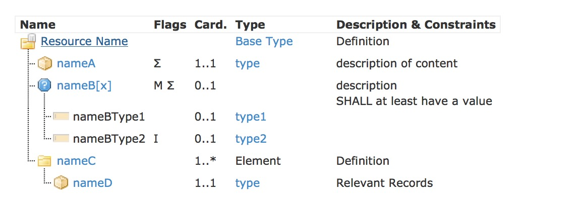

title: 
date:  
categories: doc
---		

[首页](../home/index.html) >[文档](documentation.html) >[资源定义](resources.html) > **资源格式**       

*   [Content](#)
*   [XML](xml.html)
*   [JSON](json.html)
*   [对应关系](resource-mappings.html)
### 1.18.0 资源格式    
这部分记录了如何描述资源的内容.在实际的交换当中,资源可以是[XML](xml.html)或者 [JSON](json.html)格式的.    
#### 1.18.0.1 资源定义      
资源有多种描述方式：
* 层级化的表格，
* UML图
* XML的伪代码
* JSON的伪代码
还有如W3C schema和schematron，[StructureDefinition](structuredefinition.html)

##### 1.18.0.1.1 表格
树状结果的资源内容的逻辑试图

| 列 | 内容 |
| ---- | ---- |
| 名称 | 资源中元素的名称，XML元素名称，JSON属性名称，有些名称的后缀是“[x]”。除此之外，图标表示的是内容的类型 |
| 标记 | 元素如何影响解读人员处理元素的信息 |
| 基数 |  |
| 类型 | 元素的数据类型 |
| 描述和约束 | 对元素的描述和具体的约束信息 尤其是可编码元素 可使用编码的信息 |   

如下图所示




类型和标记图标的说明：
* ：资源的基础元素
* ：Bundle的基础元素
* ：An element that is part of the resource and has elements within it defined in the same resource or profile
* ：可以是多种类型的元素
* ：拥有value属性的元素
* ：拥有其他元素的元素
* ：包含对其他资源的引用的元素
* ：和资源内其他元素拥有同样内容的元素
* ：Introduction of a set of slices (see Slicing)
* ：扩展
* ：复杂的扩展-嵌套了扩展的扩展
* ：只包含value，不包含嵌套扩展的扩展项
* ：The root of a logical profile
* M：该元素为modifying元素 参考http://hl7-fhir.github.io/conformance.html#isModifier
* S：该元素为必须支持的元素 参考http://hl7-fhir.github.io/conformance.html#mustSupport
* Σ：钙元素为summary集合中的其中之一 参考 http://hl7-fhir.github.io/search.html#mustSupport
* I：该元素受invariants的影响 参考 http://hl7-fhir.github.io/conformance.html#invariants
* NE：该元素不能包含扩展

注意：
* 资源和元素名称都是大小写敏感的
* 任何数据类型为基本数据类型的元素都会有一个“value”属性，其中包含了该元素的值
* "value"的值不能为空，要么不存在，存在的话值必须为非空字符串
* 元素的基数规定了该元素可或必须出现的次数
* Unless elements have children defined directly (as nameC does above) they are assigned one or more types. Most of the types are defined in the data types. All the type names are hyperlinked to the source definition
* 元素服用：一些数据类型的子元素和其他元素的子元素是一样的。
* 当一个元素存在多种数据类型时，采用nnn[x]的形式来表示，nnn的部分为固定值，[x]可以用类型的名称来替换。
* 每个元素名称都有一个超链接，指向数据字典中该元素的正式定义
* 任何拥有id属性的元素都可以作为内部引用的目标。The id attribute is not shown in this format. Extensions are not always shown, but may appear except where the flag "NE" appears
* 元素不能为空。如果资源中出现了某个元素，要么有一个value属性，要么有定义好的子元素，要么有1到多个扩展项
* 在逻辑视图中并没有显示所有资源都共有的基础架构类元素，它们是在[Resource](resource.html)和[DomainResource](domainresource.html)中所定义的


###### 1.18.0.1.2 XML(已废弃)       

XML语法使用如下标记：     

```
 <Name xmlns="http://hl7.org/fhir" (attrA="value")> 
   <nameA><!-- 1..1 type description of content  --><nameA>
   <nameB[x]><!-- 0..1 type1|type2 description  --></nameB>
   <nameC> <!--  1..* -->
     <nameD><!-- 1..1 type>Relevant records  --></nameD>
   </nameC>
 <name>

```
注意:      
*    资源和元素名称是大小写敏感的()
*    数据类型为[基本数据类型](datatypes.html#primitive)的任何元素都有一个value属性.其中包含了该元素的实际值.      
*    元素都有一个基数用以标识该元素可以或者必须出现的次数. 如果基数的字体是粉红色,也就说还有其他条件影响该基数.这种情况存在于鼠标悬停的文本或者正规定义当中.    
*    除非元素直接包含子元素(如上例中的nameC),不然它们总归是有一个或datatypes.htmldatatypes.html多个数据类型.除"Resource"和"Narrative"之外,除"Resource"和"Narrative"之外都是在[数据类型](datatypes.html)中定义的. 数据类型的名称是超链接形式的.           
*    一些数据类型的子元素和资源中定义的其他一些元素的子元素是一样的.这样的情况下,该元素的数据类型会存在一个指向[path]的引用,而[path]就是拥有已事先定义好子元素的元素.    
*    当一个逻辑元素能够有不止一个数据类型时,它们的名称采用先定义好子元素的元素.    nnn[x]的形式.其中nnn的部分为名称,是固定不变的,[x]可以用实际使用的类型标题大写字幕名称来替换,比如:    
```
  <name>
    <nameBType1>
     ... contents for type1 ...
    </nameBType1>
  </name>
```     
该元素允许使用的数据类型用"|"来分隔,当其中之一是Resource([X])时,元素名称当中的类型名称就简化成"Resource"     
*    伪语法中的每个元素名称都可以超链接到数据字典中该元素的正规定义上去.     
*    如果元素名称是带下划线的,意味着应用程序必须[支持](conformance-rules.html#mustSupport)和/或[理解](conformance-rules.html#ismodifier)该元素.     
*    FHIR元素值永远不能为空. 如果资源中出现了某个元素,它应该要么有一个value属性,子元素,要么有1到多个[扩展](extensibility.html)     
 
 *    属性值也永远不能为空.要么不存在,要么至少要有一个非空格的内容.         
 
##### 1.18.0.1.2 UML       

UML图用一些类来表示资源的元素。


当元素的数据类型为可选时，使用上述XML语法中一样的方式来表示可选项。考虑到UML的原理，元素实际的顺序不能够由图来确定的，也无法确定该元素是属性还是元素。元素和类型能够链接到正式定义中。UML图也能显示绑定，也有到详细绑定信息的超链接。     
 
 
这些UML图旨在人与人之间资源内容的交流,不适合于用标准的UML代码生成工具来生成代码.     

##### 1.18.0.1.3 Wire Format Representations
在实际的数据交换过程中使用如下如下方式来表示数据：
*   [XML](xml.html)
*   [JSON](json.html)
*   [RDF]()

 Clients and servers can choose whether to implement in XML or JSON. In the interests of interoperability, Servers SHOULD support both formats. Systems SHALL declare which format(s) they support in their Conformance Statement. If a server receives a request for its conformance statement in a format it does not otherwise support, it SHALL return a 415 Unsupported Media Type. 
 
 
 &copy; HL7.org 2011 - 2014. FHIR DSTU (v0.2.1-2606)构建于2014  7月2号 16:29+0800 星期三 . 
链接：[试行版是什么](http://hl7.org/implement/standards/fhir/dstu.html) |[版本更新情况](http://hl7.org/implement/standards/fhir/history.html) | [许可协议](http://hl7.org/implement/standards/fhir/license.html) |[提交变更建议](http://gforge.hl7.org/gf/project/fhir/tracker/?action=TrackerItemAdd&tracker_id=677)      