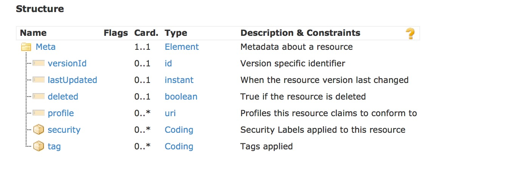
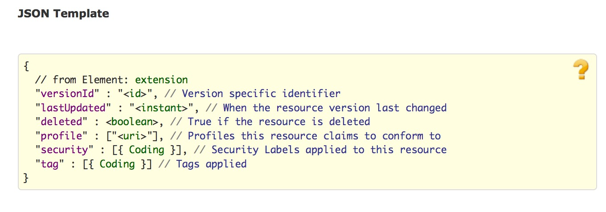

title: 
date: 
categories: doc
---

[首页](../home/index.html) >[文档](documentation.html) > **Base Resource**

*   [Content](#)
*   [示例](resource-examples.html)
*   [详细描述](resource-definitions.html)
*   [对应关系](resource-mappings.html)
*   [规范](resource-packages.html)
*   [Operations](resource-operations.html)
#  1.12.1 Base Resource Definitions

## 1.12.1.1 范围和用途

该标准中定义了一系列不同类型的资源，可以用来交换或存储数据，以此来解决很多卫生保健领域相关的问题，不论是行政管理上的还是临床上的．另外，该标准还定义了很多交换资源的不同方法．

一个资源，也就是一个实体　拥有如下特点：

*   拥有一个可寻址的标识　　
*   自身是该标准中所定义的某种资源类型　　
*   包含诸多在资源定义中所描述的结构化数据项　　
*   包含一种供人可读的对资源内容的XHTML的表达形式　
*   可能随着时间而发生变化　　

资源有多种表达形式。如果能满足上述条件，依据标准中定义的规则，不管是XML还是JSON ，我们都认为是一个有效的资源，也允许其他的表达形式 ，但该标准中并未描述。　　

资源可以有多种表达格式. 如果能够满足上述规则，同时满足标准中所定义的[XML](xml.html)或 [JSON](json.html)中的规则， 可认为该资源是有效的。

## 1.12.1.2 边界和关系

所有资源都拥有如下数据项和属性，可能是可选的　也可能是强制存在的:

*   一个标识
*   元数据
*   所采用的主要语言
*   对&quot;隐含规则Implicit Rules&quot;的引用

绝大多数资源都是从 [Domain Resources](domainresource.html)衍生出来的 - 它们也可以包含文本、内嵌式资源、扩展以及针对某个领域的特殊的一些数据项。 有一类特殊的用于对资源进行groups/lists的资源叫[Bundle](bundle.html) . 

备注: there is documentation for the [Structure](formats.html), [UML](formats.html#uml), [XML](xml.html), and [JSON](json.html) representations. 

## 1.12.1.3 Resource Content

*   [Structure]()
	
*   [UML](#tabs-uml)
	
*   [XML](#tabs-xml)
	
*   [JSON](#tabs-json)
	
*   [All](#tabs-all)

### 1.12.1.3.1 Terminology Bindings

<table class="grid"> <tr><th>Path</th><th>Definition</th><th>Type</th><th>Reference</th></tr> <tr><td title="Language" valign="top">Resource.language </td><td valign="top">语言</td><td>[Fixed](terminologies.html#code)</td><td valign="top">[IETF language tag](http://tools.ietf.org/html/bcp47)  <!-- g --></td> </tr></table>

### 1.12.1.3.2  Resource 标识

每个资源都有一个字段&quot;id&quot; ，其中包含了存储该资源的服务器为其分配的一个逻辑标识符。除了即将在服务器上完成新增的资源(服务器会 通过([create interaction](http.html#create))为其分配标识符)之外，其他资源都是拥有已知的逻辑标识符的。在同一个服务器中，同一类型的资源范围内逻辑标识符是唯一的。一旦分配好了标识符将永不更改，即使在其他地方该资源的副本可能不会保留原来的标识。

一个完整的标识是由服务器地址、资源类型和逻辑标识符三部分形成的绝对URL地址， http://test.fhir.org/rest/Patient/123 (123就是逻辑标识符). 备注不应认为资源标识总是能够指向一个服务器，可能由于服务器暂时无法访问，或者是由于政策原因，防火墙原因无法访问，或者该主机本身就不存在。资源是通过标识相互引用的。引用中的标识可以是相对或绝对地址 (更多细节请参考 [Resource References](references.html)).从一个服务器中复制和移动资源到另一台服务器中意味着要为资源重新分配标识符，[更多信息请参考 资源标识的管理](managing.html).

逻辑标识符是大小写敏感的，外部系统不必也无需确定其内部结构. An id SHALL always be represented in the same way in 
resource references and URLs. Ids可以是36字符长，包含任意的大小写ASCII 字母, 数字, &quot;-&quot; and &quot;.&quot;. 

### 1.12.1.3.3  Resource Metadata资源元数据

每个资源都有一个字段"meta"，数据类型为"Meta",其中包含了一系列元数据，有技术相关的，也有与工作流相关的。所有元数据项都是可选的，在一些实现中可以要求某些为必选项。

<table class="grid"><tr>    <th>Metadata Item</th>    <th>Type</th>    <th>Usage</th>  </tr>  <tr>    <td>versionId (0..1)</td>    <td>[id](datatypes.html#id)</td>    <td>随资源内容的变更而变化. 可在[resource reference](references.html#Resource)中使用.可用于确保某次更新是对资源最新版本的变更。版本号可以是全球唯一，也可以是逻辑标识符范围内的唯一，常常是递增的序列号，UUID或任何其他方式产生的。服务器最好能够支持版本号，但不做强制性要求.</td>  </tr>  <tr>   <td>lastUpdated (0..1)</td> <td>[instant](datatypes.html#instant)</td>   <td>如果要给该字段赋值，随资源内容的变更而变化, 可以用在系统或人为判断资源内容是否是最新的。     Note that [version aware updates](http.html#update) do not use this element(使用etags)</td>  </tr>  <tr>   <td>profile (0..*)</td> <td>[uri](datatypes.html#uri)</td>   <td>表示资源内容遵循某个profile规范的要求. 更多信息请参考 [Extending and Restricting Resources](profiling.html#resources)。随profile和value set的变化或随系统重新核实一致性而变化</td>  </tr>  <tr>   <td>security (0..*)</td>   <td>[Coding](datatypes.html#Coding)</td>   <td>能够运用到资源中的[Security labels](security-labels.html)。通过这些标签，将资源内容与某些特定的安全策略联系起来。安全标签可随资源内容的变化而变化，也可由安全体系来决定是否变化 Security tags can be updated when the resource changes, or whenever the security sub-system chooses to</td>  </tr>  <tr>   <td>tag (0..*)</td>   <td>[Coding](datatypes.html#Coding)</td><td>运用到该资源的[Tags](extras.html)。标签是用于将资源与流程、工作流程关联起来。在解读资源的含义时无需考虑标签内容 </td>  </tr></table>

*   [Structure]()
	
*   [UML](#tabs-uml)
	
*   [XML](#tabs-xml)
	
*   [JSON](#tabs-json)
	
*   [All](#tabs-all)

 Meta is used in the following places: [Resource](resource.html)

###  1.12.1.3.4  Implicit Rules隐含的规则

在资源形成之后，如何使用资源的[约定custom agreement](profiling.html#agreement)，而且在处理资源内容时必须理解这些规则.

如果遵循这样的一些协议也就限制了资源内容只能被一小撮合作机构是引用。长远来看会影响数据的可用性，应尽可能避免这种情况。但现实情况是现有的医疗系统是高度碎片化的，还没有到那种以同一种可交换的方式来定义、采集和交换数据的程度

注意的是大多数资源在构建时都会遵循一些自定义的协议，Note that resources are almost always constructed following some custom agreement.
Best practice is that such agreements make all knowledge about the content 
of the resource explicit; if custom agreements do this, and declare their extensions
as required, then it is not necessary to understand the agreement when processing the 
resource content.(这大段在说什么)

### 1.12.1.3.5  Language

每个资源都有一个language元素、字段，用于指定资源内容主体上是采用何种语言[采用BCP 47中的编码](http://tools.ietf.org/html/bcp47).
该字段主要是为了提高索引和访问的效率。并不存在默认语言，但可以从语境中推断出来。并非所有资源内容都必须是规定的语言所表达的。

如果规定了该字段的值，在 [叙述性文本](narrative.html#Narrative)中也应该进行规定. 在处理叙述性文本内容时使用
叙述性文本中的html language tag .资源中的language 标签主要是用在规定从资源中数据所生成的其他格式的表示方式中使用的语言 

### 1.12.1.3.6 Tags, Profiles, and Security Labels

这三个元数据属性虽是资源的一部分，但不会用来储存那些解读资源内时必须理解的信息。它们的作用仅仅是控制资源的访问和发现，将资源内容与工作流程、技术流程联系起来。

#### 1.12.1.3.6.1  Tags标签

标签用于将额外的操作性信息与资源关联起来，包括工作流管理。标签的典型应用是维护一个待评估的资源列表。

在通用型标签当中， [concept](datatypes.html#coding) 可以引用某个医疗术语、医疗字典，包括了标准本身所定义的，HL7定义的和其他如SNOMED CT LOINC等。也可以是自定义的。

#### 1.12.1.3.6.2 Profile Tags

该标签表示资源内容遵循某个 [规范](profile.html),也就是说遵循该规范中定义的什么内容可以放在资源中规则，term的值就是所引用的规范资源的URL

根据规范即可对资源内容完成校验，确定资源时是否满足规范中的要求 ( [validation tools](downloads.html)
提供了这样的功能). 
然而某些情况下要完成资源内容 的校验不是那么现实:

*   服务器要从很多个资源中检索出满足某个规范中的其中一个
*   接收方有很多个规范不知道拿哪个来校验资源 

Profile Tags标签适用于这样的场景——客户端或资源的构建方可以在资源上打上标签，表示资源遵循某个规范的要求。服务器/接收方可以根据该标签的值进行选择，或者根据该标签的值来选择校验资源内容所需的规范。

备注: 单个资源可同时遵循多个规范的要求。 遵循某个规范的资源可以不打上遵循该规范的标签，也可以在不遵循某个规范的情况下声称遵循某个规范.鉴于此，处理资源内容的应用程序应根据资源内容来处理资源，根据规范来对资源内容做出校验，而非轻信该标签的值。在大多数交互协议中会对何时何地打上那类标签，进行哪类校验做出规定。 

Profile Tags用于查找遵循某类规范的资源的一种方法，而非是资源内容含义的声明

#### 1.12.1.3.6.3 Security Labels

安全性标签用于在资源中提供一些与安全相关的元数据。详情请参考[Security Labels](security-labels.html).

### 1.12.1.3.7 Further Information

*   [Conformance Rules](conformance-rules.html)
*   [Resource Definitions](resources.html)
*   [References between Resources](references.html)
*   [Narratives](narrative.html)
*   [Formats:](formats.html) [XML](xml.html), [JSON](json.html)*   [Extensibility](extensibility.html) ([Examples](extensibility-examples.html))
*   [Detailed Descriptions](resource-definitions.html)
*   [Inter-version Compatibility](compatibility.html)

## 1.12.1.4 Search Parameters

该资源可用的通用查询变量. 更多查询相关信息请参考 [Searching](search.html) for more information about searching in REST, messaging, and services.

<table class="list"><tr><td>**Name**</td><td>**Type**</td><td>**Description**</td><td>**Paths**</td></tr><tr><td>_id</td><td>[token](search.html#token)</td><td>Logical id of this artefact</td><td>Resource.id</td></tr><tr><td>_language</td><td>[token](search.html#token)</td><td>Language of the resource content</td><td>Resource.language</td></tr><tr><td>_lastUpdated</td><td>[date](search.html#date)</td><td>When the resource version last changed</td><td>Resource.meta.lastUpdated</td></tr><tr><td>_profile</td><td>[token](search.html#token)</td><td>Profiles this resource claims to conform to</td><td>Resource.meta.profile</td></tr><tr><td>_security</td><td>[token](search.html#token)</td><td>Security Labels applied to this resource</td><td>Resource.meta.security</td></tr><tr><td>_tag</td><td>[token](search.html#token)</td><td>Tags applied</td><td>Resource.meta.tag</td></tr></table>
