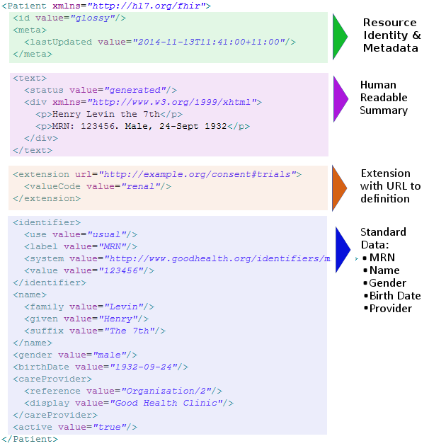

title: 
date: 
categories: doc
---

  [首页](../home/index.html) >[文档](documentation.html) > **总结**	

#1.7  HL7 FHIR简介  

[获取PDF格式的该文档](../material/fhir-summary.pdf)

FHIR&reg; – Fast Health Interoperable Resources (hl7.org/fhir) – 是由HL7创建的新一代标准框架.FHIR整合了HL7 V2,V3 和CDA的优点,同时利用了最新的Web标准,紧紧围绕着implementability可实现性.

FHIR 解决方案是基于一些称之为“资源”的模块化组件的.  这些资源可以很容易的组装进生产系统中,以已有方案的一小部分成本来解决实际的临床和管理上存在的问题.
FHIR适用于多种场景– 智能手机APP、云平台上的通信、基于EHR的数据共享、大型医疗机构内服务器通信和其他。

##1.7.1    FHIR好在哪里  

FHIR在现有标准基础上做了很多改进:  

*   主要关注实现 – 实现起来很快很容易(很多开发人员在单个工作日记就能完成一些简单的接口)   
*   多种实现的库,有很多示例可以帮助开发   
*   标准供免费使用，无额外限制    
*   即开即用的互操作性– 基础的资源可以直接拿来用，也可以根据本地实际需求做一些约束。 
*   从HL7 V2 CDA演化而来 – 这些标准可以共存， 相互使用   
*   依赖Web标准– XML, JSON, HTTP, Atom, OAuth等等.    
*   支持RESTful架构，同时支持使用消息或文档进行无缝地信息交换     
*   简练、易于理解的标准  
*   提供一种开发人员易于使用的人可读的格式wire format
*   基于本体的分析 并提供一个映射以确保正确性

##1.7.2 Flexibility   

卫生保健标准的一个核心挑战在于说如何应对多样的卫生保健流程造成的多样性。随着时间的推移，越来越来的字段和可选性添加到规范当中，最终增加了实现的复杂度和成本。另外一种则是依赖自定义扩展的方式，但这种也会给实现带来诸多问题。  

FHIR通过定义一个扩展和改造已有资源的简单框架来解决这一难题。不论是如何开发的，使用同一框架，所有系统，可以像获取其他资源一样很容易地解读这些扩展和对扩展的定义。

另外，每个资源都会有一部分供人可读的文本表示，用htmlL来表达，作为保证临床安全的一种选择。对于很多采用基于简单文本或文档方式的诸多系统中复杂的临床信息， 这点尤为重要。

##1.7.3  资源示例: Patient   

该示例展示了一个资源有哪些关键部分: 一个本地扩展，一个供人可读的html的表示和标准所定义的数据内容.

FHIR 中有针对诸如病人、医务人员、医疗机构和设备的管理性概念的资源，也有很多涵盖了疾病、用药、诊断、治疗计划和财务等临床概念的资源  

##1.7.4 The FHIR 开发过程   

FHIR已经发布了试行版。在试行期间，HL7积极地关注着各种实现方案以期能够持续不断对其进行完善，能够响应不同的需求。鉴于FHIR提供的诸多优点，很多地方已经开始试运行.   
照这样子发展，HL7 FHIR极有可能在2015年成为正式标准。

&copy; HL7.org 2011 - 2014. FHIR DSTU (v0.2.1-2606)构建于2014  7月2号 16:29+0800 星期三 . 
链接：[试行版是什么](http://hl7.org/implement/standards/fhir/dstu.htmll) |[版本更新情况](http://hl7.org/implement/standards/fhir/history.htmll) | [许可协议](http://hl7.org/implement/standards/fhir/license.htmll) |[提交变更建议](http://gforge.hl7.org/gf/project/fhir/tracker/?action=TrackerItemAdd&tracker_id=677) 	 		